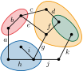

# Definition

:::{.column-margin}
{width=100%}
:::

A graph is cluster planar if there is a planar drawing of it where we can also add its
clusters as closed regions that only cross the edges that leave the respective cluster.

Formally, given a graph $G=(V,E)$ equipped with a cluster hierarchy $T$, which is a rooted tree with the vertices $V$ as
leaves.
Each inner node $\mu$ of $T$ represents a *cluster* encompassing all leaves $V_\mu$ of the subtree rooted at $\mu$.
A cluster planar drawing is a planar drawing that also maps every cluster $\mu$ to a simple closed region $R_\mu$ such
that

1. $R_\mu$ encloses exactly the vertices $V_\mu$,
2. no two cluster region boundaries intersect, and
3. no edge intersects the boundary of a cluster more than once.
   A cluster graph is cluster planar if it admits a cluster planar drawing.

# Background

@len-hpt-89 studied and solved this problem as early as 1989 in the setting where the clusters are
connected. @fce-pfc-95, who coined the term Clustered Planarity, rediscovered this algorithm and asked the general
question where disconnected clusters are allowed. This question remained open for 30 years.
In that time, polynomial-time algorithms were found for many special-cases
[@adl-cpw-19;@cdbf-cpo-08;@fkmp-cpt-15;@gjl-aic-02] before @ft-aec-22 found an $O((n+d)^8)$
solution in 2019, where $d$ is the number of crossings between a cluster-border and an edge leaving the cluster.
Subsequently, @bfr-spw-21 gave a solution via $synchronized with a running time of $O((n+d)^2)$, which also reveals the
main concepts for solving Clustered Planarity.

# Complexity

Let $d$ be the number of edge-cluster boundary crossings and $\Delta$ be the maximum number of edges crossing a single
cluster border.
While there are no direct solutions to the problem, Clustered Planarity can be solved in time...

- $O((n+d)^2)\subset O(n^4)$ via $synchronized [@bfr-spw-21]
- $O(n+d\cdot \Delta)\subset O(n^4)$ via $synchronized with SPQR-node expansion [@fr-mtc-23]
- $O((n+d)^8)\subset O(n^{16})$ via Atomic Embeddability [@ft-aec-22]

All these reductions use the cd-Tree representation of Clustered Planarity [@br-anp-16].
As the reduction subdivides an edge for each cluster boundary it crosses, the representation has size $O(n+d)$.

{width=30%}
{width=65%}

Clustered Planarity also reduces to $sefe-2 by representing the cluster boundary, where the order of edges leaving needs
to correspond to the order of the same edges entering, via a
gadget [@sch-tat-13, Theorem 6.17; see also @rut-se-20, Section 13.2.2].

$abg are a generalization of Clustered Planarity, where given counts of edge-edge, cluster-cluster, and cluster-edge crossings are allowed [@alb-rtc-15].

# See also

- [Wikipedia Article](https://en.wikipedia.org/wiki/Clustered_planarity)
- Handbook on Graph Drawing and Visualization [@pat-pta-13, Section 1.8.2]