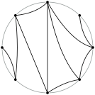

# Definition

:::{.column-margin}
{width=100%}
:::

A graph is outerplanar if it can be embedded in the plane such that no two edges
cross and all vertices are incident to the same face, which we chose to be the outer one.

# Complexity

@ch-ppg-67, who initially studied the problem, provide a Kuratowsky-style characterisation as graphs that do not contain a subdivision of $K_4$ or $K_{2,3}$.
Outer Planarity can be tested in linear time [@mit-lat-79].
A linear-time algorithm also follows from the reduction to the linear-time solvable $standard problem.

# Related Problems

The problem can be reduced to $standard by inserting an *apex* vertex that is connected to all other vertices [@sch-tat-13].

# See also
- [Wikipedia Article](https://en.wikipedia.org/wiki/Outerplanar_graph)
- [Information System on Graph Classes and their Inclusions Entry](https://www.graphclasses.org/classes/gc_110.html)