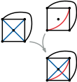

# Definition

:::{.column-margin}
{width=100%}
:::

<!-- TODO -->

# Background

<!-- TODO -->

# Complexity

Simultaneous Embedding with Fixed Edges is NP-complete for instances...

- TODO

## Partial Solutions

- TODO

# Related Problems

- Reduces to $max-sefe
- Reduces to $sefe-3
