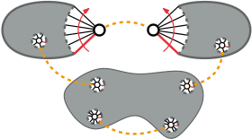
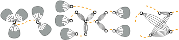
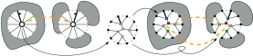

# Definition

:::{.column-margin}
{width=100%}
:::

<!-- TODO -->

# Background

<!-- TODO -->

:::{#fig-syncplan-ops}
{width=100%}

{width=100%}

{width=100%}

The operations used to solve Synchronized Planarity.
:::

# Complexity

Synchronized Planarity can be solved in time...

- TODO

## Partial Solutions

- TODO

# Related Problems

- Reduces to $sefe-2
